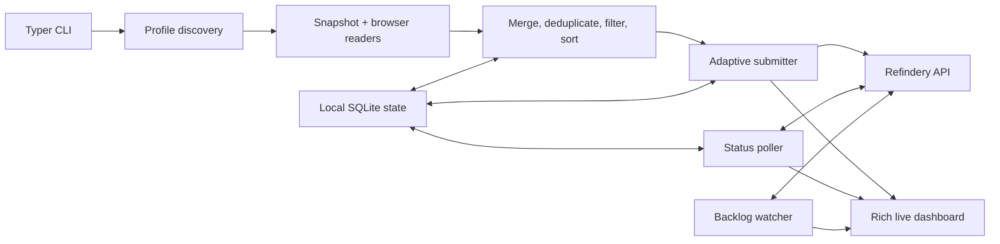

# Architecture and backend contract

`browser-history-refindery` is a Typer CLI with synchronous browser readers, an
asynchronous local state store and HTTP client, and a materialized-plan import
pipeline. Internal Python modules are implementation details rather than a
stable library API.

## Component map



The package entry point is
`browser_history_refindery.cli:app`. Command functions perform synchronous CLI
setup and enter the async pipeline with `asyncio.run`.

## Read and plan phase

Browser readers use the standard-library SQLite client and run through
`asyncio.to_thread`. Each reader copies the main database and WAL/SHM sidecars
to a temporary directory, opens the copy read-only, and returns aggregated
`VisitRecord` values.

`pipeline.run_import` fully materializes the plan before network submission:

1. read each profile from its watermark;
2. merge identical URLs across profiles;
3. load submission visit timestamps and permanent rejections from state;
4. deduplicate and apply `ExclusionEngine`;
5. persist local skip reasons;
6. sort newest-first and apply `--limit`; and
7. calculate which profile watermarks remain safe to advance.

Materialization makes totals and ordering deterministic and lets `--dry-run`
render the exact plan. Its memory use grows with the number of distinct URLs in
the read window.

## Concurrent delivery phase

An `asyncio.TaskGroup` runs three long-lived tasks:

- the submitter drains an in-memory queue through `AdaptivePacer`;
- the status poller advances recorded page IDs toward `indexed` or `dead`; and
- the backlog watcher feeds pending-job depth into the pacer.

A separate refresh task redraws the Rich dashboard. It is cancelled after the
task group exits so UI refresh does not participate in pipeline termination.

Runtime-only `ExceptionGroup` failures are unwrapped to their first application
error so the CLI can print focused remediation. The first `SIGINT` requests a
graceful shutdown; the second cancels pipeline tasks.

## Correctness invariants

- The `submissions` table—not profile watermarks—is the source of truth for
  deduplication and resumption.
- Watermarks are read optimizations and advance only after a complete,
  uninterrupted run with zero exhausted submissions.
- Limiting a run withholds watermarks for profiles represented by dropped
  candidates.
- Profile watermark identity combines `browser_id` with the resolved history
  path; human-readable statistics may use a shorter display key.
- HTTP `422` is a terminal permanent rejection. It is never retried
  automatically.
- A server blacklist response is persisted as a handled submission outcome.

## Local state schema

Schema version 3 has four tables:

| Table | Purpose |
| --- | --- |
| `runs` | Start/end timestamps and aggregate outcome counters. |
| `submissions` | One row per URL, page ID, outcome, latest server status, errors, and represented visit time. |
| `skips` | One row per locally excluded URL and its first matching rule. |
| `profile_watermarks` | Latest cleanly processed visit per path-aware browser profile. |

SQLite WAL mode and foreign keys are enabled. Migrations add missing columns
from older supported schemas. A future schema version raises
`StateSchemaTooNewError` before any downgrade can occur.

## Refindery HTTP contract

Every request uses `Authorization: Bearer TOKEN` and the configured base URL.

| Method and path | Purpose | Response expected by the importer |
| --- | --- | --- |
| `GET /readyz` | Startup readiness gate | `200` when ready. |
| `POST /v1/pages` | Submit URL-only ingest metadata | `202` accepted, `200` revisit, `403` blacklisted, `401` auth failure, or `422` validation rejection. |
| `GET /v1/pages/{page_id}/status` | Poll page lifecycle | JSON status in `queued`, `indexing`, `indexed`, `failed`, or `dead`. |
| `GET /v1/jobs?status_filter=pending&limit=N` | Estimate backlog | A list, or an object containing a list, whose rows are counted up to `N`. |
| `POST /v1/forget` | Purge URL/domain and create blacklist rule | Purge count, rule ID, pattern, kind, and vector deletion count. |
| `GET /v1/blacklist` | List server rules | An `entries` array. |
| `DELETE /v1/blacklist/{id}` | Remove one rule | Any successful HTTP response. |

### Ingest request

`POST /v1/pages` sends no page body. The validated JSON shape is:

```json
{
  "url": "https://example.com/article",
  "title": "Example article",
  "source": "history-import:chrome",
  "fetched_at": "2026-07-10T16:00:00+00:00",
  "metadata": {
    "browser": "chrome",
    "profile": "Personal",
    "visit_count": 3,
    "first_visit_at": "2026-07-01T12:00:00+00:00",
    "last_visit_at": "2026-07-10T16:00:00+00:00",
    "hostname": "macbook.example"
  }
}
```

When several profiles contain the URL, `metadata.sources` contains the browser,
profile, visit count, and first/last timestamps for each source. Null fields are
omitted.

## Compatibility policy

The CLI commands, config keys, environment variable, database migration rules,
and backend wire contract are public behavior. Maintain backward compatibility
or document migrations when they change. Python module paths and classes remain
internal unless a future release explicitly promotes them to a supported API.
