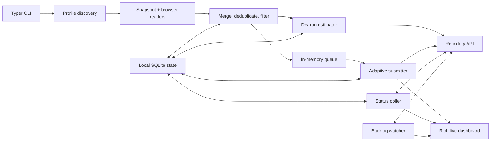

# Architecture and backend contract

`browser-history-refindery` is a Typer CLI with synchronous browser readers, an
asynchronous local state store and HTTP client, and a streaming import pipeline.
Internal Python modules are implementation details rather than a stable library
API.

## Component map



The package entry point is
`browser_history_refindery.cli:app`. Command functions perform synchronous CLI
setup and enter the async pipeline with `asyncio.run`.

## Streaming read and plan phase

Browser readers use the standard-library SQLite client and run through
`asyncio.to_thread`. Each reader copies the main database and WAL/SHM sidecars
to a temporary directory, opens the copy read-only, and returns aggregated
`VisitRecord` values.

For an unbounded import, `pipeline.run_import` overlaps planning and delivery:

1. load submission visit timestamps and permanent rejections from state;
2. read one profile from its watermark;
3. merge its records into the shared URL map;
4. deduplicate, apply `ExclusionEngine`, and persist local skip reasons;
5. enqueue that profile's eligible URLs newest-first; and
6. repeat while the submitter drains the queue.

The merge map remains live while profiles are read. A queued URL therefore gains
later-profile metadata until its HTTP attempt takes an immutable snapshot. A
URL already sent keeps its earlier snapshot; when revisit resubmission is
enabled, a later, newer sighting can enqueue it again.

`--limit` fully materializes all profiles, globally sorts candidates
newest-first, and emits only the selected prefix. Profiles represented by
dropped candidates do not offer a watermark. `--dry-run` also reads all
profiles without starting the delivery tasks, then makes a one-shot readiness
probe and optional batch-estimate requests. Estimation failures use the cached
per-server profile for unresolved pages and never change submission or
watermark state.

## Concurrent delivery phase

An `asyncio.TaskGroup` runs four long-lived tasks:

- the producer streams profile work into the queue;
- the submitter drains an in-memory queue through `AdaptivePacer`;
- the status poller advances recorded page IDs toward `indexed` or `dead`; and
- the backlog watcher feeds pending-job depth into the pacer.

A separate refresh task redraws the Rich dashboard. It is cancelled after the
task group exits so UI refresh does not participate in pipeline termination.

Runtime-only `ExceptionGroup` failures are unwrapped to their first application
error so the CLI can print focused remediation. The first `SIGINT` requests a
graceful shutdown; the second cancels pipeline tasks.

## Correctness invariants

- The `submissions` table—not profile watermarks—is the source of truth for
  deduplication and resumption.
- Watermarks are read optimizations and advance only after a complete,
  uninterrupted run with zero exhausted submissions.
- Limiting a run withholds watermarks for profiles represented by dropped
  candidates.
- Profile watermark identity combines `browser_id` with the resolved history
  path; human-readable statistics may use a shorter display key.
- HTTP `422` is a terminal permanent rejection. It is never retried
  automatically.
- A server blacklist response is persisted as a handled submission outcome.

## Local state schema

Schema version 4 has five tables:

| Table | Purpose |
| --- | --- |
| `runs` | Start/end timestamps and aggregate outcome counters. |
| `submissions` | One row per URL, page ID, outcome, latest server status, errors, and represented visit time. |
| `skips` | One row per locally excluded URL and its first matching rule. |
| `profile_watermarks` | Latest cleanly processed visit per path-aware browser profile. |
| `estimation_profiles` | Latest validated fallback estimate profile per normalized Refindery base URL. |

SQLite WAL mode and foreign keys are enabled. Migrations add missing columns
from older supported schemas. A future schema version raises
`StateSchemaTooNewError` before any downgrade can occur.

## Refindery HTTP contract

Every `/v1` request uses `Authorization: Bearer TOKEN` and the configured base
URL; `GET /readyz` is probed without requiring authentication. Real imports
require **Refindery >= 0.2.0** and fail fast unless readiness advertises batch
ingest and status. Live dry-run estimates additionally require
`capabilities.batch_estimate`; missing support degrades to cached or unavailable
estimates without failing the command.

| Method and path | Purpose | Response expected by the importer |
| --- | --- | --- |
| `GET /readyz` | Startup readiness gate + capability probe | `200` with `capabilities.batch_ingest` and `capabilities.batch_status` for imports; `capabilities.batch_estimate` enables live dry-run estimates. |
| `POST /v1/pages/batch` | Submit up to 100 URL-only ingest items | `200` with an ordered `results` array; each item carries an `outcome` of `accepted` (202-equivalent), `revisit` (200), `blacklisted` (403), or `rejected` (422), plus its input `index`. `401` fails the whole batch. |
| `POST /v1/pages/estimate/batch` | Estimate up to 100 URL-only ingest items without persistence or paid-provider calls | `200` with a validated fallback `profile` and exactly one indexed result per input: `estimated`, `revisit`, `blacklisted`, `rejected`, or `unavailable`. |
| `POST /v1/pages/status/batch` | Poll up to 500 page lifecycles | `200` with a `results` array; each entry is `found=true` with `status` in `queued`/`indexing`/`indexed`/`failed`/`dead`, or `found=false` for an unknown id. |
| `GET /v1/jobs?status=pending&limit=N` | Estimate backlog | A list, or an object containing a list, whose rows are counted up to `N`. |
| `POST /v1/forget` | Purge URL/domain and create blacklist rule | Purge count, rule ID, pattern, kind, and vector deletion count. |
| `GET /v1/blacklist` | List server rules | An `entries` array. |
| `DELETE /v1/blacklist/{id}` | Remove one rule | Any successful HTTP response. |

### Ingest request

`POST /v1/pages/batch` and `POST /v1/pages/estimate/batch` send no page bodies.
Both use a validated `{"pages": [...]}` envelope whose items each look like:

```json
{
  "url": "https://example.com/article",
  "title": "Example article",
  "source": "history-import:chrome",
  "fetched_at": "2026-07-10T16:00:00+00:00",
  "metadata": {
    "browser": "chrome",
    "profile": "Personal",
    "visit_count": 3,
    "first_visit_at": "2026-07-01T12:00:00+00:00",
    "last_visit_at": "2026-07-10T16:00:00+00:00",
    "hostname": "macbook.example"
  }
}
```

When several profiles contain the URL, `metadata.sources` contains the browser,
profile, visit count, and first/last timestamps for each source. Null fields are
omitted. Batch size is `[submit].batch_size` (1–100); status polling reads up to
`[poller].batch_size` (1–500) ids per request.

Estimate responses represent storage in integer bytes and USD costs as decimal
strings. A result with an unpriced paid component has a null total plus an
`unpriced_components` list; the importer never treats it as zero. The fallback
profile includes a configuration fingerprint, generation timestamp, per-page
storage/cost values, component breakdown, and the same unpriced-component
semantics. Missing, duplicate, or out-of-range result indices invalidate the
whole estimate batch.

## Compatibility policy

The CLI commands, config keys, environment variable, database migration rules,
and backend wire contract are public behavior. Maintain backward compatibility
or document migrations when they change. Python module paths and classes remain
internal unless a future release explicitly promotes them to a supported API.
